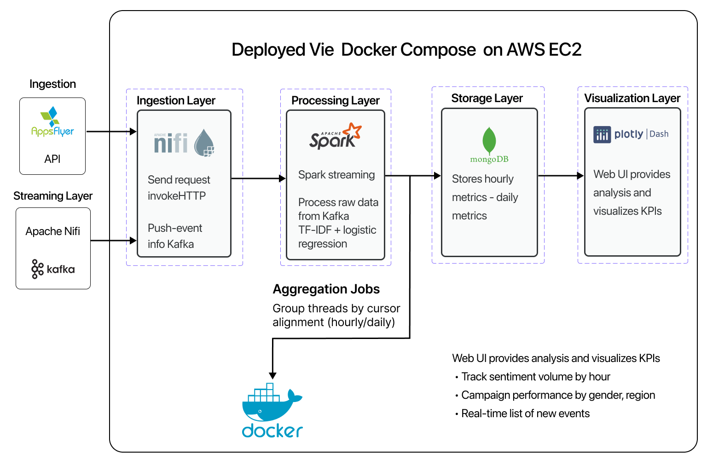
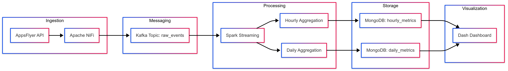

## Overview
---

### Business Objective
<details open>
<summary>Provide real-time insights from marketing analytics</summary>

---
- Deliver up-to-date metrics from AppsFlyer campaigns to marketing teams.
- Help answer: "Which campaigns drive installs right now?" and "What is today's app performance?"
- Enable fast decision-making via aggregated hourly/daily data in dashboards.
---

</details>

### Project Scope
<details open>
<summary>Scope of the end-to-end real-time system</summary>

---
- Ingest data from AppsFlyer REST API via NiFi.
- Stream processing pipeline: NiFi → Kafka → Spark Streaming.
- Perform time-based aggregation of install and event data.
- Store metrics in MongoDB for querying.
- Visualize key KPIs via Dash (Plotly).
- Containerized deployment on AWS EC2 using Docker Compose.
---

</details>

## Engineering Highlights
---

<details open>
<summary>Key Contributions, Notes, and Design Insights</summary>

---
#### Key Contributions
- Designed and implemented an end-to-end real-time data pipeline using NiFi, Kafka, and Spark Streaming.
- Developed NiFi flow to authenticate and extract data from AppsFlyer API with retry logic.
- Built structured streaming jobs in PySpark to perform time-windowed aggregation and output results to Kafka and MongoDB.
- Containerized the entire stack using Docker Compose for reproducibility and scalability on AWS EC2.
- Developed interactive dashboards using Dash (Plotly) with auto-refresh for near real-time insights.
- Optimized MongoDB schema for fast time-based queries by campaign and day/hour.
- Ensured observability with NiFi bulletins, Kafka CLI monitoring, and Spark UI.
- Documented full deployment steps, architecture diagram, and integration flows.
---

#### Additional Notes
- Applied `InvokeHTTP` in NiFi with retry logic for AppsFlyer API call stability.
- Configured Kafka topic retention to 24 hours to handle reprocessing needs.
- Used Spark's `withWatermark()` and `window()` for out-of-order event handling.
- Dash auto-refresh interval set to 30 seconds; can be changed via environment variable.
---

#### Design Considerations
- Decoupled ingestion (NiFi → Kafka) and processing (Kafka → Spark) for better fault tolerance.
- MongoDB schema normalized per time granularity (hour/day) to avoid scan overhead.
- Used Docker named volumes to persist Kafka and MongoDB data across restarts.
- Infrastructure is portable and repeatable with `docker-compose up`.
---

</details>


## Pipeline Architecture
---

### Architecture Diagram
<details open>
<summary>Full system flow</summary>

---

---

</details>

### Data Flow Diagram
<details open>
<summary>ETL/Streaming flow from ingestion to dashboard</summary>

---

---

</details>

### Technology Stack
<details open>
<summary>Component breakdown</summary>

---
- **Apache NiFi**: Calls AppsFlyer API and sends data to Kafka.
- **Apache Kafka**: Event streaming backbone with topics for raw and aggregated data.
- **Apache Spark Streaming**: Aggregates metrics over time windows.
- **MongoDB**: Stores aggregated analytics by campaign and timestamp.
- **Dash**: Displays data on a real-time dashboard.
- **Docker Compose**: Manages containerized infrastructure.
---

</details>

## Ingestion Strategy
---

### AppsFlyer Integration
<details open>
<summary>How data is collected from AppsFlyer</summary>

---
- Use NiFi `InvokeHTTP` processor to call AppsFlyer API periodically.
- Authenticated using API token and `app_id`.
- Retrieve raw install/conversion data in JSON format.
- Publish each event to Kafka topic `raw_events`.
---

</details>

### Kafka Topics
<details open>
<summary>Message structure and stream design</summary>

---
- `raw_events`: Contains raw JSON events fetched from AppsFlyer.
- `aggregated_metrics`: Aggregated installs/conversions per time window.
- Messages use timestamp field (event_time) for proper windowing.
---

</details>

## Stream Processing
---

### Spark Structured Streaming
<details open>
<summary>Transform and aggregate raw events</summary>

---
- Consume data from Kafka topic `raw_events`.
- Parse fields: campaign name, media source, timestamp, platform.
- Perform time-based aggregation:
  - Installs per campaign (hourly)
  - Installs per campaign (daily)
- Use `watermark` to handle late data.
- Output to Kafka topic `aggregated_metrics`.
---

</details>

### MongoDB Output
<details open>
<summary>Persisting processed metrics</summary>

---
- Spark writes data to two MongoDB collections:
  - `hourly_metrics`: Hourly installs per campaign
  - `daily_metrics`: Daily installs per campaign
- Each document includes:
  - Campaign name
  - Time window (hour/day)
  - Total installs
  - Timestamp
- Each document includes:
  - Campaign name
  - Aggregation window
  - Install count
  - Timestamp
- Enables fast querying by time and campaign.
---

</details>

## Dashboard Integration
---

### Dash Interface
<details open>
<summary>Live visualization of campaign KPIs</summary>

---
- Dash connects to MongoDB and queries `campaign_stats`.
- Shows:
  - Campaign performance per hour
  - Daily summary across campaigns
  - Time series trends with line/bar charts
- Auto-refreshes every 30–60 seconds.
---

</details>

### AWS Deployment
<details open>
<summary>How to run on EC2</summary>

---
- Launch EC2 instance (Ubuntu 20.04, t2.large+).
- Install Docker and Docker Compose.
- Clone repository and run: `docker-compose up -d`
- Access:
  - NiFi: `http://<ec2-ip>:8443/nifi`
  - Dash: `http://<ec2-ip>:8050`
---

</details>

## Deployment Chronology
---

### Step-by-step Setup
<details open>
<summary>How to deploy this system on AWS EC2</summary>

---
- Launch an EC2 instance with Ubuntu 20.04 (t2.large+ recommended).
- Open necessary ports in security group: 8443 (NiFi), 8050 (Dash), 9092 (Kafka), 27017 (Mongo).
- SSH into the instance and install Docker + Docker Compose:

  ```bash
  sudo apt update
  sudo apt install docker.io docker-compose -y
  ```
  
  Clone the project repository:
  ```bash
  git clone <your_repo_url> && cd <your_repo>
  ```

  Start all services:
  ```bash
  docker-compose up -d
  ```

  Access the following:

  NiFi UI: http://<EC2_IP>:8443/nifi
  Dash: http://<EC2_IP>:8050
  Mongo Express: http://<EC2_IP>:4141
---
Full: [Environment Setup](./Configurations/environment_setup.md)

</details>

## Infrastructure Plan
---

### Cloud Services
<details open> 
<summary>Example and best practices for Docker Compose setup</summary> 

---
```yaml
version: "3.5"

volumes:
  shared-workspace:
    name: "hadoop-distributed-file-system"
    driver: local
  nifi_data:
    driver: local

networks:
  app-network:
    driver: bridge

services:
  nifi:
    image: apache/nifi:1.28.0
    ports:
      - 8443:8443
    environment:
      - NIFI_WEB_HTTP_PORT=8443
      - NIFI_SENSITIVE_PROPS_KEY=MySensitiveKey123!
    volumes:
      - nifi_data:/opt/nifi/nifi-current/data
    restart: unless-stopped
    networks:
      - app-network
    healthcheck:
      test: ["CMD", "curl", "-f", "https://localhost:8443/nifi"]
      interval: 1m30s
      timeout: 10s
      retries: 3
  ...
```
FULL: 
---

</details>

### Cloud Services
<details open>
<summary>What AWS components are required</summary>

---
- **EC2**: Main host running Docker services.
- **Security Groups**: Open required ports (Kafka 9092, Mongo 27017, Dash 8050, NiFi 8443).
- **Elastic IP**: Optional for stable access.
- **IAM**: Secure API credentials if needed.
---

</details>

### Docker Layout
<details open>
<summary>Container orchestration and services</summary>

---
- NiFi, Kafka, Zookeeper, Spark Master/Workers, Mongo, Dash defined in `docker-compose.yml`.
- Volume `shared-workspace` mounted across containers.
- Mongo Express used for admin UI (port 4141).
---

</details>

## Monitoring and Operations
---

### Observability Setup
<details open>
<summary>Monitoring and debugging tools</summary>

---
- NiFi: Logs and flow UI for debugging.
- Kafka: Topic lag metrics via CLI tools.
- Spark UI: Job monitoring at port 4040.
- Mongo Express: Live view of database.
---

</details>

### Alerting and Recovery
<details open>
<summary>Optional alerting and failover suggestions</summary>

---
- **Kafka Lag**: Monitor lag for `raw_events` and `aggregated_metrics` using CLI tools or Prometheus.
- **NiFi Errors**: Enable bulletin reporting or log alerts for failed API requests.
- **Spark Job Failure**: Use retry strategies or watchdog container restarts.
- **Mongo Disk Usage**: Monitor collection size, set TTL indexes to auto-clean old data.
---

</details>

## Supplementary Information
---

<details open>
<summary>Supplementary Files</summary>

---
- **Docker Compose Setup**: [docker-compose.yml](./docker-compose.yml)  
- **Environment Guide**: [AWS EC2 Setup](./Configurations/environment_setup.md)  
- **Demo Video**: [YouTube](https://www.youtube.com/watch?v=O11hk6In59w)  
---

</details>


## Terminology
---

### Glossary
<details open>
<summary>Key terms used in the system</summary>

---
#### AppsFlyer
- Mobile attribution and marketing analytics platform providing install and event data.
#### Apache NiFi
- Drag-and-drop orchestration tool for ingesting APIs.
#### Kafka
- Distributed messaging platform for event streaming.
#### Spark Streaming
- Real-time stream processing engine built on Apache Spark.
#### Dash
- Python framework for building interactive web dashboards.
---

</details>

