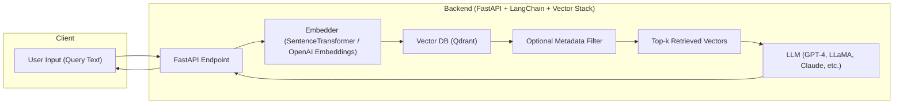

## VII. Architecture Appendix
---

### Architecture Diagram – Semantic Search / RAG Pipeline with Qdrant & FastAPI

Technical deep-dive of embedding-based retrieval architecture with LLM integration

---

#### Context from a Senior Architect

In modern AI systems, especially those involving **semantic search** or **Retrieval-Augmented Generation (RAG)**, vector databases like **Qdrant** have become critical infrastructure. They enable systems to move from brittle keyword matching to **semantic retrieval**, which is essential when grounding a **Large Language Model (LLM)** with factual, domain-specific, or up-to-date context.

The following architecture is one I would recommend for teams looking to deploy such a system **in production**, with modularity, observability, and extensibility in mind.

---

#### Mermaid Architecture Diagram

---

### Deep Technical Walkthrough

| Step | Component | Description |
|------|-----------|-------------|
|  **1. User Input** | The entry point is often a frontend UI or chatbot where users issue natural language queries. |
|  **2. FastAPI Endpoint** | This is the orchestration hub. FastAPI is chosen for its async support, ease of integration with LangChain, and fast startup — perfect for real-time LLM applications. |
| **3. Embedder** | Converts raw text into a dense vector representation using pre-trained models like OpenAI (`text-embedding-3-small`) or local Hugging Face models. This step is CPU/GPU-intensive and should be cached for frequent queries. |
| **4. Qdrant Vector DB** | Handles approximate nearest neighbor (ANN) search. Qdrant supports HNSW index with optional **payload-based filtering**, enabling hybrid search (semantic + structured). |
| **5. Optional Metadata Filter** | Critical for real-world use: filter documents by `tenant_id`, `domain`, `language`, etc. Enables **multi-tenant isolation** or **personalized retrieval**. |
| **6. Top-k Chunks** | Qdrant returns the most semantically similar documents, vectorized and ranked. These become the **context window** for the LLM. |
| **7. LLM (GPT-4 / Claude / LLaMA)** | The generative component. The retrieved chunks are injected into the prompt as part of a RAG pipeline. The LLM combines them with its knowledge to generate a final response. |
| **8. FastAPI Returns Answer** | The orchestrator packages the LLM’s output and returns it to the user. This cycle typically completes within **300–800ms** with proper caching and vector indexing. |

---

### Why This Architecture Works

- ✅ **FastAPI** as orchestrator keeps dependencies minimal and async-capable.
- ✅ **Embedding is decoupled** from vector search, enabling model experimentation.
- ✅ **Qdrant** supports both high performance ANN and rich filtering (critical in enterprise).
- ✅ **Metadata filters** are a key enabler for precision and business logic injection.
- ✅ **RAG design** ensures the LLM doesn't hallucinate but grounds responses in company data.

---

### Extension Possibilities

- Add observability: `Prometheus + Grafana` to monitor latency, recall, and search precision.
- Add caching layer: embed query fingerprints and vector hits.
- Add feedback loop: store user rating of answer → fine-tune reranker model.
- Swap FastAPI with **event-driven orchestration** (e.g., Kafka + LangChain agent executor) for streaming inputs.

---

