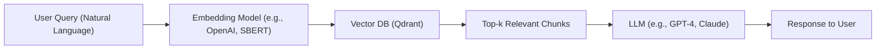

## IX. RAG Pipeline Summary
---

### Integrating Qdrant into a RAG (Retrieval-Augmented Generation) Pipeline

Overview of how Qdrant enables retrieval in a generative AI system

---

Retrieval-Augmented Generation (RAG) is a powerful design pattern that enhances a **Large Language Model (LLM)** by grounding its response in external, context-specific data retrieved at runtime. This avoids hallucination, improves factuality, and allows **domain adaptation** without retraining the model.

---

### 🔁 High-level Pipeline: `Input → Embedding → Qdrant → Context → LLM`

---

### Pipeline Breakdown

| Stage | Component | Description |
|-------|-----------|-------------|
| **1** | 🔹 **Input** | User provides a question or prompt to the system. |
| **2** | 🔹 **Embedding** | Query is transformed into a dense vector using an embedding model like OpenAI, Cohere, or `sentence-transformers`. |
| **3** | 🔹 **Qdrant Vector Search** | The vectorized query is sent to Qdrant, which performs **approximate nearest neighbor (ANN)** search over indexed document embeddings. |
| **4** | 🔹 **Top-k Context Retrieval** | Qdrant returns the `k` most semantically similar text chunks or passages. These are used to construct the LLM prompt. |
| **5** | 🔹 **LLM Completion** | The LLM (e.g., GPT-4, LLaMA, Claude) generates a response using both the user query and the retrieved context. |
| **6** | 🔹 **Output Delivery** | The final answer is returned to the user through the UI or API endpoint. |

---

### Why Use Qdrant in RAG?

- **Low-latency ANN search** with high recall (via HNSW).
- Built-in **filtering support** using vector metadata (e.g., domain, timestamp, language).
- Easy to self-host via Docker, or deploy via Qdrant Cloud.
- Production-ready: REST, gRPC, and Python SDKs available.

---

### Optional Enhancements

- Add reranking layer (e.g., BGE-Reranker) to refine top-k results.
- Use query rewriting or chunk pre-filtering to improve retrieval quality.
- Implement feedback logging (implicit or explicit) to monitor success/failure of answers.

---

