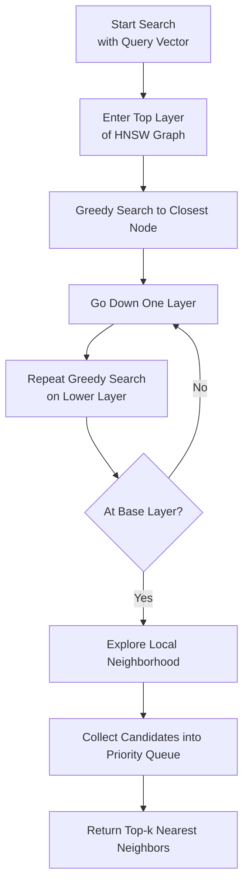

## VIII. Vector Search Internals
---

### HNSW Index Search Flow (Mermaid)

Understanding how HNSW retrieves top-k vectors efficiently

---

---

### Explanation

| Step | Description |
|------|-------------|
| **A → B** | Start by querying the topmost layer of the hierarchical graph. |
| **B → C** | Move greedily from one node to another based on closest vector similarity (e.g., cosine). |
| **C → D → E** | Once local optimum is found in one layer, descend to the next lower layer. |
| **F** | Continue descending until base layer is reached. |
| **G → H** | At base layer, use `ef_search` to explore a local neighborhood. |
| **H → I** | Return top-k vectors from the maintained candidate queue. |

---

### Key Tuning Parameters

- **`M`**: Maximum connections per node (affects accuracy vs. memory).
- **`ef_search`**: Larger values improve recall at cost of speed.
- **`ef_construction`**: Controls indexing quality (higher → better accuracy).

---

### Real-world Note from Senior Architect

> HNSW is an optimal choice when you need a high-recall, low-latency ANN solution that scales. It maintains logarithmic complexity and allows online insertions, making it ideal for applications like semantic search, RAG, and product recommendations.

---

