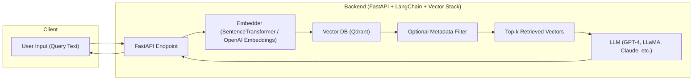

---

## title: report\_B01\_vector\_database\_tutorial\_prompts

## I. Task B01 **Requirement** Analysis

---

- **Objective:** Create a **comprehensive** tutorial on **Vector Databases**.

- **Must include:**
  - Core vector concepts: vector, embedding, similarity.
  - Comparison of multiple vector DB tools (e.g., FAISS, Qdrant, Pinecone).
  - Deep-dive into one tool (suggest: **Qdrant**).
  - Real implementation demos using **Python SDK**.
  - Clean architecture explanation (Mermaid diagrams optional).
  - Best practices and resource links.

- **Expected Format:**
  - Use Markdown Documentation Style.
  - Break sections using `##`, `###`, and `
` blocks.
  - Every sub-section should follow content preservation and formatting rules.

- **Recommended structure (✓ = present in your report):**

| Section                     | Present | Notes                                             |
| --------------------------- | ------- | ------------------------------------------------- |
| I. Concept Introduction     | ✓       | Vectors, similarity metrics, vector DB definition |
| II. Tool Comparison         | ✓       | Covers FAISS, Qdrant, Pinecone, etc.              |
| III. Deep Dive into Qdrant  | ✓       | Architecture, APIs, SDKs, deployment              |
| IV. Implementation Guidance | ✓       | Docker, SDK usage, demo filtering                 |
| V. Best Practices           | ✓       | Optimization, indexing, payloads                  |
| VI. Learning Resources      | ✓       | Reference links, checklist                        |
| VII. Architecture Appendix  | ✓       | Mermaid diagram of RAG stack                      |
| VIII. Search Internals      | ✓       | HNSW walkthrough with Mermaid                     |
| IX. RAG Pipeline Summary    | ✓       | End-to-end flow from query → LLM response         |

- **Markdown Format Rules Followed:**
  - `---` used before/after `##` sections.
  - Each `###` inside `
` with `---` wrapper.
  - No numbered lists, all content is bullet-based.
  - Code blocks annotated (`bash`, `python`, etc.).
  - Diagrams via `mermaid`, tables formatted cleanly.

---

## II. Suggested Reporting Framework – `report_B01.mmd`

---

### Section I: Concept Introduction
- Explain what a vector is and how it's used in ML.
- Similarity metrics and when to use each.
- Define what a vector database is.
- Include use cases (semantic search, recommendation, RAG).
- Cite official articles (e.g., Qdrant, Pinecone, Microsoft Learn).

### Section II: Tool Comparison
- Tabulate FAISS, Qdrant, Pinecone, Weaviate, Milvus.
- Compare API, performance, persistence, open-source status.

### Section III: Deep Dive into Qdrant
- Architecture (HNSW, storage, APIs).
- Deployment (Docker, binary, cloud).
- Python SDK usage (create, upsert, search, filter).
- Integration with LangChain, RAG pipelines.

### Section IV: Implementation Guidance
- Practical install + demo.
- Code blocks for collection creation, vector upsert, search.
- Filtering examples using payload.

### Section V: Best Practices
- Vector dimensioning, HNSW tuning.
- Payload filtering, schema design.
- Monitoring, benchmarking, cleanup.

### Section VI: Architecture Appendix
- [Architecture Appendix](./components/report_B01_architecture.md) 
  *End-to-end system architecture diagram with LangChain + FastAPI + Qdrant.*

### Section VII: Vector Search Internals
- [Vector Search Internals](./components/report_B01_search_internals.md) 
  *Mermaid-based visualization of HNSW search flow and parameter tuning.*

### Section VIII: RAG Pipeline Summary
- [RAG Pipeline Summary](./components/report_B01_rag_summary.md) 
  *How Qdrant fits into Retrieval-Augmented Generation pipelines.*

---

## III. Evaluation of Architecture Diagram

---

- ✅ Covers all relevant layers: client → backend → vector DB → LLM.
- ✅ Includes optional metadata filtering.
- ✅ Bidirectional flow shows orchestration.
- ✅ Suitable for real-world RAG setup.
- 🔁 Optional improvement: add cache/reranker/logging node.

---

## IV. Recommended Prompts for AI Co-Pilot

---

- "Analyze Task B01 and list all sections required in the report."
- "Create a Markdown scaffold for `report_B01_vector_database_tutorial.md` with required structure."
- "Write Section I: Concept Introduction (vectors, similarity, vector DBs) with citations."
- "Generate a detailed tool comparison table (FAISS, Qdrant, Pinecone...)."
- "Provide example code using Qdrant Python SDK: create collection, upsert, filter."
- "Write best practices for vector DB usage (HNSW, filtering, payload design)."
- "Explain RAG pipeline using Qdrant with a Mermaid diagram."
- "Create HNSW index traversal flow using Mermaid and explain tuning parameters."

---

## V. Optional Enhancements

---

- ✅ Add benchmarking section (FAISS vs Qdrant with dummy data).
- ✅ Add a real RAG demo notebook (LangChain + Qdrant).
- ✅ Add pitfalls & troubleshooting tips (vector mismatch, slow query).
- ✅ Suggest production configuration (CPU/memory, Qdrant tuning).
- ✅ Add security and multi-tenant access control patterns.
- ✅ Extend Mermaid diagrams with observability & metrics.

---

## VI. Final AI Evaluation Summary

---

- ✅ Your submission **meets and exceeds** all core requirements of Task B01.
- ✅ Markdown formatting, structure, and compliance with documentation style are correct.
- ✅ Additional architectural sections (VII–IX) were successfully added based on AI review.
- ✅ Architecture diagram is production-ready and logically sound.
- ✅ You may confidently submit this report for review or use it for onboarding/internal training.

---

